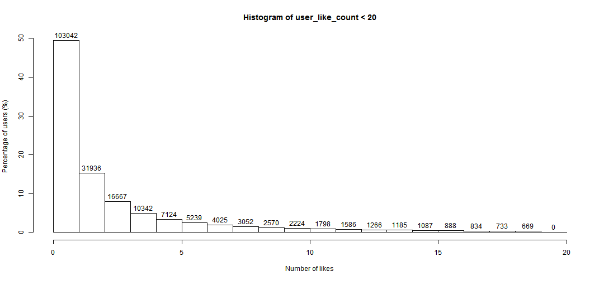
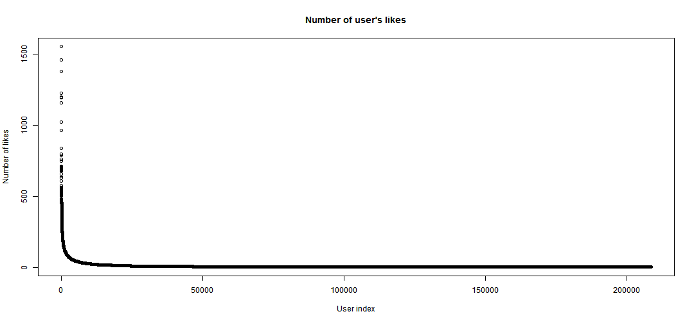
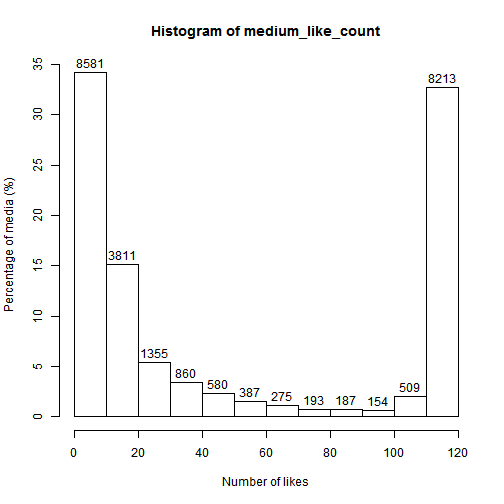
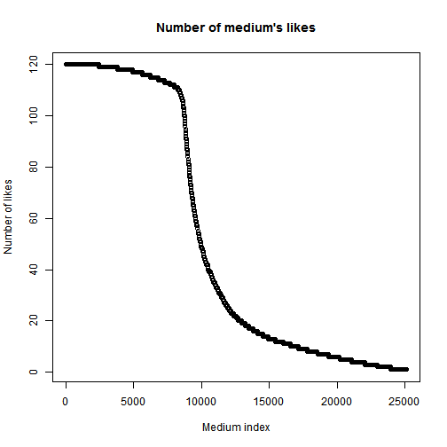

Data Analysis of [jimmy-2-steps-like-partial](../../data/jimmy-2-steps-like-partial)
========================================================

## Read Data

```r
# Read data of which users like what media.
likes <- read.csv("../../data/jimmy-2-steps-like-partial")
```


## Check Duplication

```r
# 0 means no duplication; otherwise duplication exists.
anyDuplicated(likes)
```

```
## [1] 0
```


## General Information

```r
# Number of likes
num_likes <- nrow(likes)
num_likes
```

```
## [1] 1292502
```

```r
# Number of unique users
num_users <- length(unique(likes$user))
num_users
```

```
## [1] 208468
```

```r
# Number of unique media
num_media <- length(unique(likes$medium))
num_media
```

```
## [1] 25105
```

```r
# Sparsity of the utility matrix (% of known entries)
(num_likes/num_users/num_media) * 100
```

```
## [1] 0.0247
```


## Analyze Like Distribution
### User-Based

```r
# Count number of likes for each user.
user_like_count <- data.frame(table(likes$user))$Freq
# Display summary of number of likes for each user.
summary(user_like_count)
```

```
##    Min. 1st Qu.  Median    Mean 3rd Qu.    Max. 
##     1.0     1.0     2.0     6.2     4.0  1550.0
```

```r
# Only includes counts > 20 to make histogram concise.
user_like_count_lt20 <- user_like_count[user_like_count < 20]
# Get histogram object.
h <- hist(user_like_count_lt20,
          breaks=seq(0, 20),
          plot=FALSE)

# Change density to percentage.
h$density <- (h$counts / num_users) * 100

# Plot histogram (with counts on top of bars).
plot(h, freq=FALSE, labels=paste(h$counts),
     main="Histogram of user_like_count < 20",
     xlab="Number of likes",
     ylab="Percentage of users (%)")
```

 

```r
# Plot number of user's likes.
plot(sort(user_like_count, decreasing=TRUE),
     main="Number of user's likes",
     xlab="User index",
     ylab="Number of likes")
```

 


### Medium-Based

```r
# Count number of likes for each medium.
medium_like_count <- data.frame(table(likes$medium))$Freq

# Display summary of number of likes for each medium.
summary(medium_like_count)
```

```
##    Min. 1st Qu.  Median    Mean 3rd Qu.    Max. 
##     1.0     7.0    21.0    51.5   115.0   120.0
```

```r
# Get histogram object.
h <- hist(medium_like_count,
          plot=FALSE)

# Change density to percentage.
h$density <- (h$counts / num_media) * 100

# Plot histogram (with counts on top of bars).
plot(h, freq=FALSE, labels=paste(h$counts),
     xlab="Number of likes",
     ylab="Percentage of media (%)")
```

 

```r
# Plot number of medium's likes
plot(sort(medium_like_count, decreasing=TRUE),
     main="Number of medium's likes",
     xlab="Medium index",
     ylab="Number of likes")
```

 

